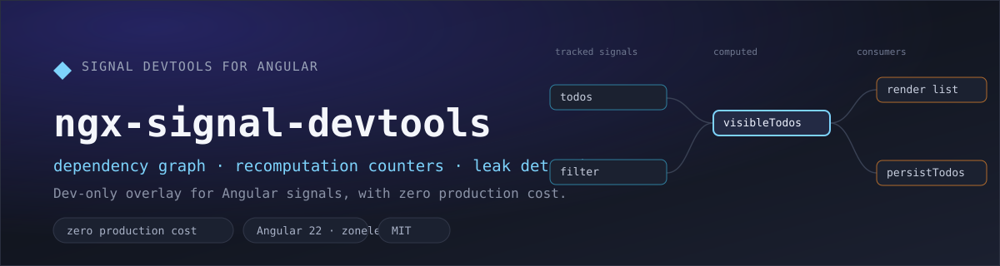
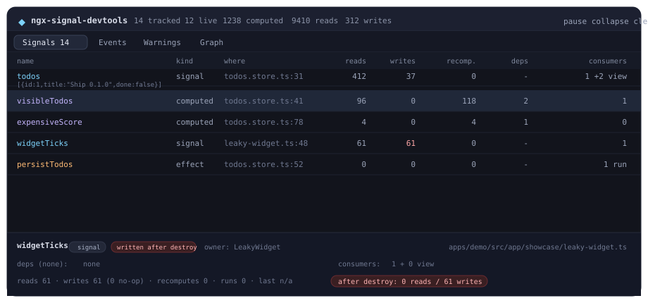

<div align="center">



**See the Angular signal graph inside your running app.**

Which computed is hot, which effect tracks nothing, which signal keeps being written after its owner
was destroyed — in a dev-only overlay, with **zero production cost**.

[](https://www.npmjs.com/package/@vitalie27dev/ngx-signal-devtools)
[](https://www.npmjs.com/package/@vitalie27dev/ngx-signal-devtools)
[](LICENSE)
[](https://github.com/VitalieCondorache/ngx-signal-devtools/actions/workflows/ci.yml)

[**📦 npm package**](https://www.npmjs.com/package/@vitalie27dev/ngx-signal-devtools) &nbsp;·&nbsp;
[**📖 library docs**](projects/ngx-signal-devtools/README.md) &nbsp;·&nbsp;
[**📝 changelog**](projects/ngx-signal-devtools/CHANGELOG.md) &nbsp;·&nbsp;
[**🎮 showcase app**](apps/demo) &nbsp;·&nbsp;
[**🚀 releasing**](docs/RELEASING.md) &nbsp;·&nbsp;
[**🐞 issues**](https://github.com/VitalieCondorache/ngx-signal-devtools/issues)

</div>

## Install

```bash
npm install --save-dev @vitalie27dev/ngx-signal-devtools
```

```ts
// app.config.ts
import { provideSignalDevtools } from '@vitalie27dev/ngx-signal-devtools';

export const appConfig: ApplicationConfig = {
  providers: [
    provideSignalDevtools(), // enabled automatically in development builds
  ],
};
```

Open the overlay with `Ctrl + Shift + S`, from the console (`ngSignalDevtools.toggle()`), or from your
own debug button via `injectSignalDevtools()`. View it on
[npm](https://www.npmjs.com/package/@vitalie27dev/ngx-signal-devtools) for the same README with the API
reference.

## The overlay



| Panel        | Content                                                                                                                  |
| ------------ | ------------------------------------------------------------------------------------------------------------------------ |
| **Signals**  | Kind, creation site, reads, writes (incl. no-op writes), recomputations, dependency and consumer counts, value previews. |
| **Events**   | Ring buffer of activity with relative timestamps and durations.                                                          |
| **Warnings** | Deduplicated diagnostics with severity, occurrence count and a hint about the likely fix.                                |
| **Graph**    | Layered SVG of the real producer/consumer edges, with destroyed nodes dimmed.                                            |

## What it gives you

- **Real dependency graph** read from the private reactive graph (`ɵSIGNAL`) with a graceful fallback —
  no manual wiring required.
- **Recomputation counters** and durations for every `computed`, so you can see what actually runs.
- **Leak detection**: signals follow their `DestroyRef`, so reads and writes after destruction,
  leaked consumers and unowned signals are reported.
- **Diagnostics with hints**: `noop-write`, `write-after-destroy`, `read-after-destroy`,
  `leaked-consumers`, `effect-without-dependencies`, `hot-signal`, `unowned-signal`.
- **Zero production cost**: the overlay is a lazy chunk (18 kB in the showcase build) and, when
  disabled, the instrumented helpers delegate straight to `signal()`/`computed()`/`effect()`.
- **Angular 22, zoneless, standalone, no runtime dependency** other than `tslib`.

Full API tables, configuration and the diagnostics reference live in the
[library README](projects/ngx-signal-devtools/README.md).

## Monorepo layout

| Path                           | What it is                                                                                                             |
| ------------------------------ | ---------------------------------------------------------------------------------------------------------------------- |
| `projects/ngx-signal-devtools` | The published library (`ng-packagr`, single entry point + lazily loaded overlay chunk).                                |
| `apps/demo`                    | Showcase app used as documentation and manual test bench (instrumented store, leak demo, no-op writes).                |
| `tools/probe-internals.mjs`    | Canary that prints the private reactive node shape of the installed Angular version.                                   |
| `docs/RELEASING.md`            | Maintainer guide: build outputs, npm authentication, provenance and the release checklist.                             |
| `docs/images`                  | README artwork and the GitHub social preview: `banner.svg`, `overlay-preview.svg`/`.png`, `social-preview.svg`/`.jpg`. |

## Development

```bash
npm install
npm run build:lib      # the demo imports the library from dist/, so build it first
npm start              # http://localhost:4200 — press Ctrl+Shift+S for the overlay
```

While working on the library, run `npm run watch:lib` in a second terminal and the demo reloads with
your changes.

| Script                    | Description                                                                   |
| ------------------------- | ----------------------------------------------------------------------------- |
| `npm run build:lib`       | Production build of the library into `dist/vitalie27dev/ngx-signal-devtools`. |
| `npm run watch:lib`       | Development build in watch mode.                                              |
| `npm run test:lib`        | Vitest + coverage for the library (57 tests, thresholds enforced).            |
| `npm run test:demo`       | Smoke tests for the showcase app.                                             |
| `npm run test:all`        | Both suites — what CI runs.                                                   |
| `npm start`               | Serve the demo app.                                                           |
| `npm run build:demo`      | Production build of the demo (shows the lazy overlay chunk).                  |
| `npm run lint`            | ESLint (angular-eslint).                                                      |
| `npm run format`          | Prettier over the workspace.                                                  |
| `npm run probe:internals` | Verify the private `ɵSIGNAL` contract for the installed Angular version.      |
| `npm run pack:lib`        | Build + `npm pack` the library, then print the tarball contents.              |
| `npm run release`         | Build, bump, changelog, tag and publish via release-it.                       |

## Quality gates

- ESLint (angular-eslint, typescript-eslint) + Prettier, conventional commits enforced by commitlint.
- Vitest with coverage thresholds for the library, plus a smoke suite for the demo.
- CI on every push and PR: probe the private contract → lint → format → tests with coverage → build
  the library → build the demo → inspect the published tarball.
- Releases are automated with `release-it`; publishing from CI emits npm provenance (see
  [docs/RELEASING.md](docs/RELEASING.md)).

## Contributing

Bug reports, ideas and pull requests are welcome — see [CONTRIBUTING.md](CONTRIBUTING.md). When
reporting a bug, attaching the output of `ngSignalDevtools.snapshot()` makes it much faster to fix.

## License

[MIT](LICENSE) © Vitalie Condorache
